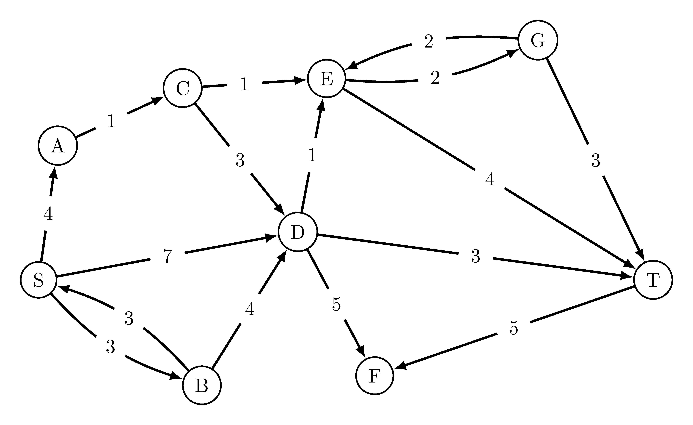

# Dijkstra

[![Python CI][ci-img]][ci-url]
[![Coverate Status][coveralls-img]][coveralls-url]



Package author: Jukka Aho (@ahojukka5, ahojukka5@gmail.com)

dijkstra is a native Python implementation of famous Dijkstra's shortest path
algorithm. The implemented algorithm can be used to analyze reasonably large
networks. The primary goal in design is the clarity of the program code. Thus,
program code tends to be more educational than effective.

Project source code is licensed undet MIT license. The source code of the
project is hosted on on GitHub: <https://github.com/ahojukka5/dijkstra>.
Releases of this package are hosted in PyPi, where they can be easily accessed
using `pip`: <https://pypi.org/project/dijkstra/>.

## Installing package

To install the most recent package from Python Package Index (PyPi), use git:

```bash
pip install dijkstra
```

To install the development version, you can install the package directly from
the GitHub:

```bash
pip install git+git://github.com/ahojukka5/dijkstra.git
```

[ci-img]: https://github.com/ahojukka5/dijkstra/workflows/Python%20CI/badge.svg
[ci-url]: https://github.com/ahojukka5/dijkstra/actions
[coveralls-img]: https://coveralls.io/repos/github/ahojukka5/dijkstra/badge.svg?branch=master
[coveralls-url]: https://coveralls.io/github/ahojukka5/dijkstra?branch=master

## Usage

Package implements two classes, `DijkstraSPF` and `Graph`. The above example can
be solved with the following code:

```python
S, T, A, B, C, D, E, F, G = nodes = list("STABCDEFG")

graph = Graph()
graph.add_edge(S, A, 4)
graph.add_edge(S, B, 3)
graph.add_edge(S, D, 7)
graph.add_edge(A, C, 1)
graph.add_edge(B, S, 3)
graph.add_edge(B, D, 4)
graph.add_edge(C, E, 1)
graph.add_edge(C, D, 3)
graph.add_edge(D, E, 1)
graph.add_edge(D, T, 3)
graph.add_edge(D, F, 5)
graph.add_edge(E, G, 2)
graph.add_edge(G, E, 2)
graph.add_edge(G, T, 3)
graph.add_edge(T, F, 5)

dijkstra = DijkstraSPF(graph, S)
```

After running an algorithm, the shortest distance to each node, starting from
`S`, is available:

```python
print("%-5s %-5s" % ("label", "distance"))
for u in nodes:
    print("%-5s %8d" % (u, dijkstra.get_distance(u)))
```

```text
label distance
S            0
T           10
A            4
B            3
C            5
D            7
E            6
F           12
G            8
```

Also, we can extract the path. From S to T, the path is:

```python
print(" -> ".join(dijkstra.get_path(T)))
```

```text
S -> D -> T
```

It's not mandatory to use `Graph`. To use your own data structure for graph, you
need to subclass `AbstractDijkstraSPF` and implement two functions connecting
graph object to the shortest path finder algorithms: `get_adjacent_nodes` and
`get_edge_weight`. For example, implementation of `DijkstraSPF` using `Graph`
is the following:

```python
class DijkstraSPF(AbstractDijkstraSPF):

    @staticmethod
    def get_adjacent_nodes(G, u):
        return G.get_adjacent_nodes(u)

    @staticmethod
    def get_edge_weight(G, u, v):
        return G.get_edge_weight(u, v)
```

## References

- <https://en.wikipedia.org/wiki/Dijkstra%27s_algorithm>
